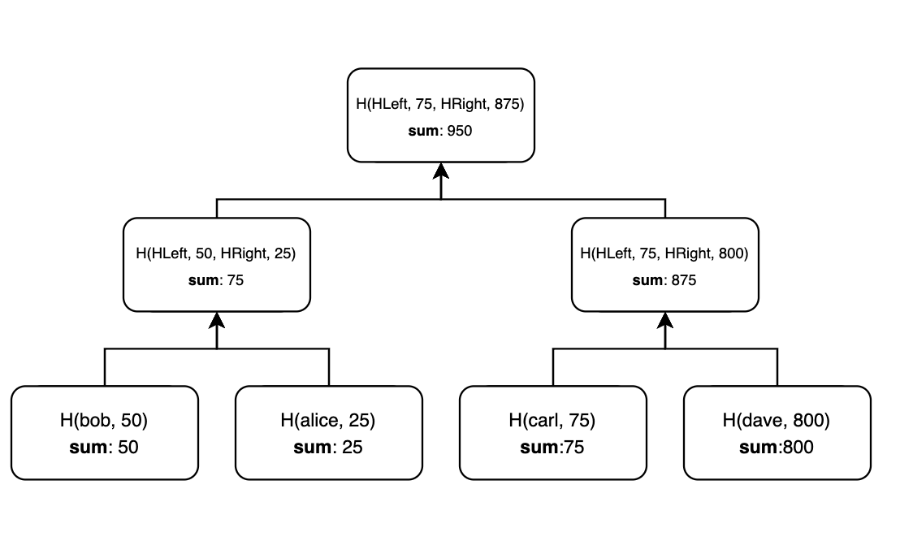

# TS Merkle Sum Tree

**This package is a fork of [ZK-KIT](https://github.com/privacy-scaling-explorations/zk-kit)**

## What is a Merkle Sum Tree?

A Merkle Sum Tree is a binary Merkle Tree with the following properties:

- Each entry of a Merkle Sum Tree is a pair of a value and a sum. 
- Each Leaf Node contains a hash and a sum. The hash is equal to H(value, sum). The sum is equal to the sum itself.
- Each Middle Node contains a hash and a sum. The hash is equal to H(LeftChild.hash, LeftChild.sum, RightChild.hash, RightChild.sum). The sum is equal to the sum of the sums of its children.
- The Root Node represents the committed state of the Tree and contains the sum of all the entries' sums.

<div align="center">

</div>
<br>

## Install 

```npm install ts-merkle-sum-tree``` 

## APIs

\# **new IncrementalMerkleSumTree**(hash: _HashFunction_, depth: _number_): _IncrementalMerkleSumTree_

```typescript
import { IncrementalMerkleSumTree } from "ts-merkle-sum-tree"
import { poseidon } from "circomlibjs" // v0.0.8

const tree = new IncrementalMerkleSumTree(poseidon, 16) // Binary tree with 16 levels and poseidon hash function
```

\# **insert**(entryValue: _bigint_, entrySum: _bigint_)

```typescript
tree.insert(BigInt(1), BigInt(25))
```

\# **update**(index: _number_, newEntryValue: _bigint_, newEntrySum: _bigint_)

```typescript
// 0 is the index of the leaf to be updated
tree.update(0, BigInt(2), BigInt(50))
```

\# **delete**(index: _number_)

```typescript
// 0 is the index of the leaf to be deleted
tree.delete(0)
```

\# **getTreeSum** 

```typescript
tree.root.sum 
```

\# **indexOf**(entryValue: _bigint_, entrySum: _bigint_): _number_

```typescript
const index = tree.indexOf(BigInt(2), BigInt(50)) // 0
```

\# **createProof**(index: _number_): _MerkleProof_

Creates a proof of membership. The MerkleProof contains the path from the leaf to the root.

```typescript
const proof = tree.createProof(0)
```

\# **createProofWithTargetSum**(index: _number_, targetSum: _bigint_): _MerkleProofWithTargetSum_

Creates a proof of membership with target Sum. The MerkleProofWithTargetSum contains the path from the leaf to the root and the target sum of the tree.

```typescript
const merkleProofWithTargetSum = tree.createProof(0, BigInt(75))
```

\# **verifyProof**(proof: _MerkleProof_): _boolean_

Verifies a proof and returns true or false.
It verifies that a leaf is included in the tree and that the sum computed from the leaf to the root is equal to the total sum of the tree.

```typescript
console.log(tree.verifyProof(proof)) // true
```

\# **verifyWithTargetSum**(merkleProofWithTargetSum: _MerkleProofWithTargetSum_): _boolean_

Verifies a proofWithTargetSum and returns true or false.
In addition to the verifyProof method, it verifies that the sum of the tree is less or equal to the target sum.

```typescript
console.log(tree.verifyProofWithTargetSum(merkleProofWithTargetSum)) // true
```
## Code Quality and Formatting

Run ESLint to analyze the code and catch bugs:

```npm run lint```

Run Prettier to check formatting rules and to fix them:

```npm run format```

## Testing

```npm run test```

